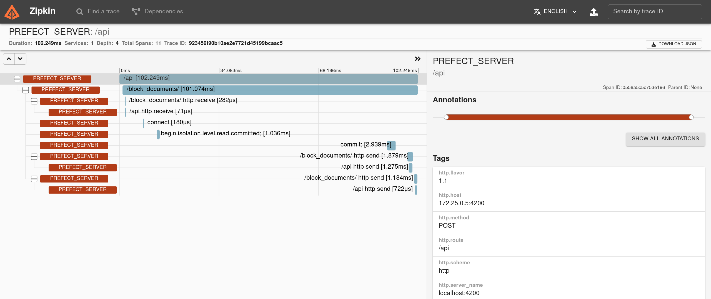

# prefect-opentelemetry

## Welcome!

Extend prefect Orion with [Opentelemetry](https://opentelemetry.io/) capability to monitor the server side

## Getting Started

This project create a new Perfect orion factory that wrap the original one and add opentelemetry capability for the following area

- FastAPI
- SQLAlchemy
- Postgres
- SQLLite

This is setup to only export all the opentelemetry at the format OTLP to an exporter that you can use after to dispatch to your metrics, log or trace.

## Run Sample

The project has a docker compose file that allow you to start a server with PostgreSQL which will push the trace to Zipkin. The sample is using OpenTelemetry-Collector as a buffer. This allow you to push your trace to any standard trace like [zipkin](https://zipkin.io/), [jeager](https://www.jaegertracing.io/) or [tempo](https://grafana.com/docs/tempo/latest/)
Sample view from zipkin



### Python setup

Requires an installation of Python 3.8+ .

We recommend using a Python virtual environment manager such as pipenv, conda or virtualenv.

These tasks are designed to work with Prefect 2.0. For more information about how to use Prefect, please refer to the [Prefect documentation](https://orion-docs.prefect.io/).


<!-- 
No pushed yet to pypi
### Installation

Install `prefect-opentelemetry` with `pip`:

```bash
pip install prefect-opentelemetry
``` -->

> **Note**
> Because this change the base factory that create FastAPI app, you cannot use ```prefect orion start```

Start Prefect server using manual command of uvicorn

```
uvicorn --app-dir $(python -c 'import prefect; print(prefect.__module_path__.parent)')  --factory  prefect_opentelemetry.server:create_app_with_OTLP --host 0.0.0.0 --port 4200
```

The part ```$(python -c 'import prefect; print(prefect.__module_path__.parent)')``` allow to setup the app-dir to ensure the UI can work.

The setup of the server is done using env var. You can find the list from prefect [here](https://docs.prefect.io/concepts/settings/). The import one to setup are 

- **[PREFECT_ORION_DATABASE_CONNECTION_URL](https://docs.prefect.io/concepts/settings/#database-settings)**: Coonection string to the database
- **[OTEL_EXPORTER_OTLP_TRACES_ENDPOINT](https://github.com/open-telemetry/opentelemetry-specification/blob/main/specification/protocol/exporter.md#configuration-options)**: URL to the OTLP colletor using gRPC
- **PREFECT_ORION_SERVICES_SCHEDULER_ENABLED**: To only enable the scheduler
- **PREFECT_ORION_ANALYTICS_ENABLED**: To enable Analytic
- **PREFECT_ORION_SERVICES_LATE_RUNS_ENABLED**: To enable late run
- **PREFECT_ORION_SERVICES_UI**: To enable the UI


## Resources

If you encounter any bugs while using `prefect-opentelemetry`, feel free to open an issue in the [prefect-opentelemetry](https://github.com/davzucky/prefect-opentelemetry) repository.

If you have any questions or issues while using `prefect-opentelemetry`, you can find help in either the [Prefect Discourse forum](https://discourse.prefect.io/) or the [Prefect Slack community](https://prefect.io/slack).

## Development

If you'd like to install a version of `prefect-opentelemetry` for development, clone the repository and perform an editable install with `pip`:

```bash
git clone https://github.com/davzucky/prefect-opentelemetry.git

cd prefect-opentelemetry/

pip install -e ".[dev]"

# Install linting pre-commit hooks
pre-commit install
```
